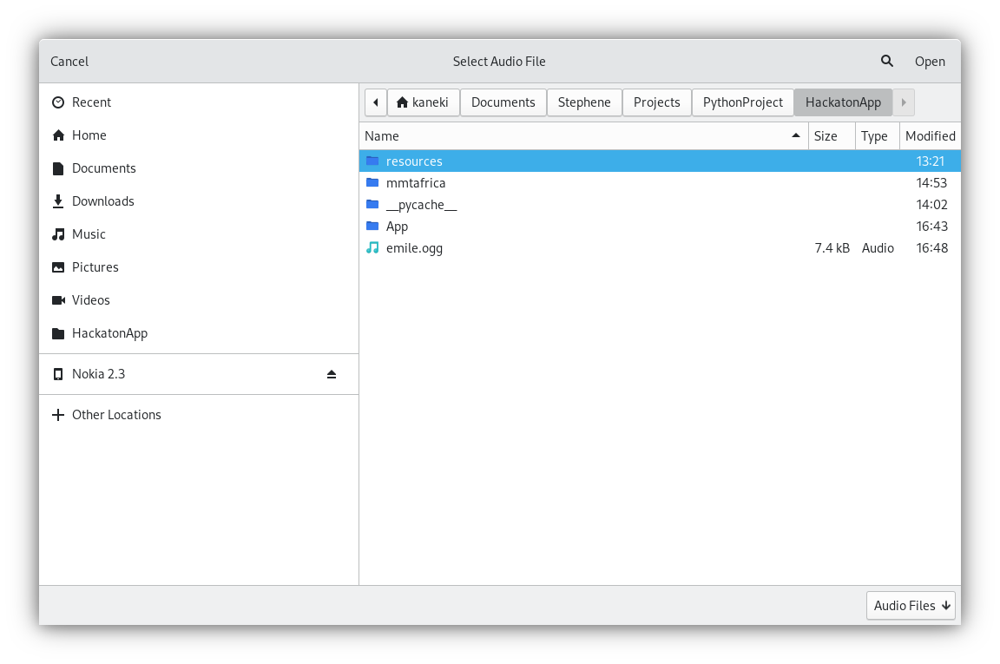
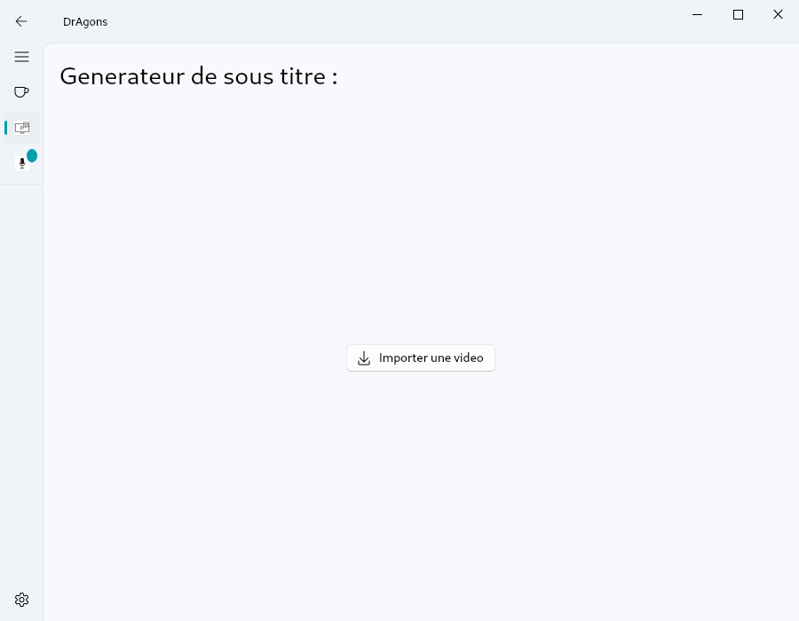
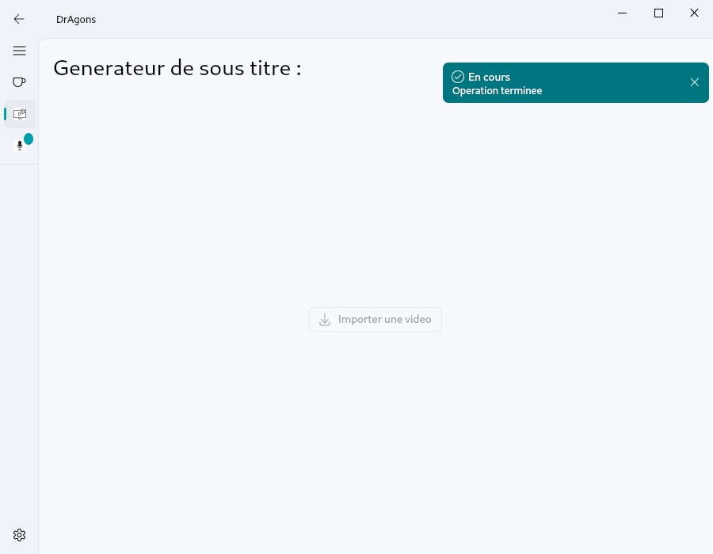
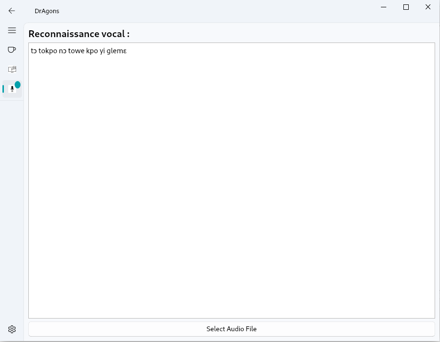

# Générateur de Sous-titres et Transcription Vocale en Langue Fon

L'application Générateur de Sous-titres et Transcription Vocale en Langue Fon est un outil polyvalent conçu pour simplifier le processus de création de sous-titres pour les vidéos en langue locale fon et de transcription de fichiers audio en texte. Cette application offre deux fonctionnalités principales : la génération de sous-titres pour les vidéos et la transcription vocale.

## Fonctionnalités Principales

### 1. Génération de Sous-titres en Langue Locale Fon pour les Vidéos

La fonction de génération de sous-titres permet aux utilisateurs de créer des sous-titres pour leurs vidéos en langue locale fon. L'application utilise un modèle de langage spécialement formé pour la langue fon afin de produire des sous-titres précis et de haute qualité. Les utilisateurs peuvent simplement sélectionner une vidéo à partir de leur système de fichiers et l'application générera automatiquement les sous-titres correspondants.

### 2. Transcription Vocale en Texte

La fonction de transcription vocale permet aux utilisateurs de convertir des enregistrements audio en texte. Les utilisateurs peuvent importer des fichiers audio contenant des discours, des entretiens, des notes vocales, etc., et l'application transcrira automatiquement le contenu vocal en texte. Cela offre un moyen pratique de convertir des enregistrements vocaux en formats texte pour une analyse, une recherche ou une utilisation ultérieure.

## Installation et Utilisation

Pour utiliser cette application, suivez les étapes suivantes :

1. Téléchargez le code source de l'application depuis le dépôt GitHub.
2. Assurez-vous que les dépendances nécessaires, telles que les bibliothèques Python, sont installées sur votre système.
3. Lancez l'application en exécutant le script principal.
4. Utilisez l'interface utilisateur de l'application pour sélectionner les vidéos ou les fichiers audio que vous souhaitez traiter.
5. Utilisez les fonctionnalités de génération de sous-titres ou de transcription vocale selon vos besoins.

## Captures d'Écran

Les captures d'écran ci-dessus illustrent l'interface utilisateur de l'application et montrent comment les utilisateurs peuvent interagir avec les fonctionnalités de génération de sous-titres et de transcription vocale.

